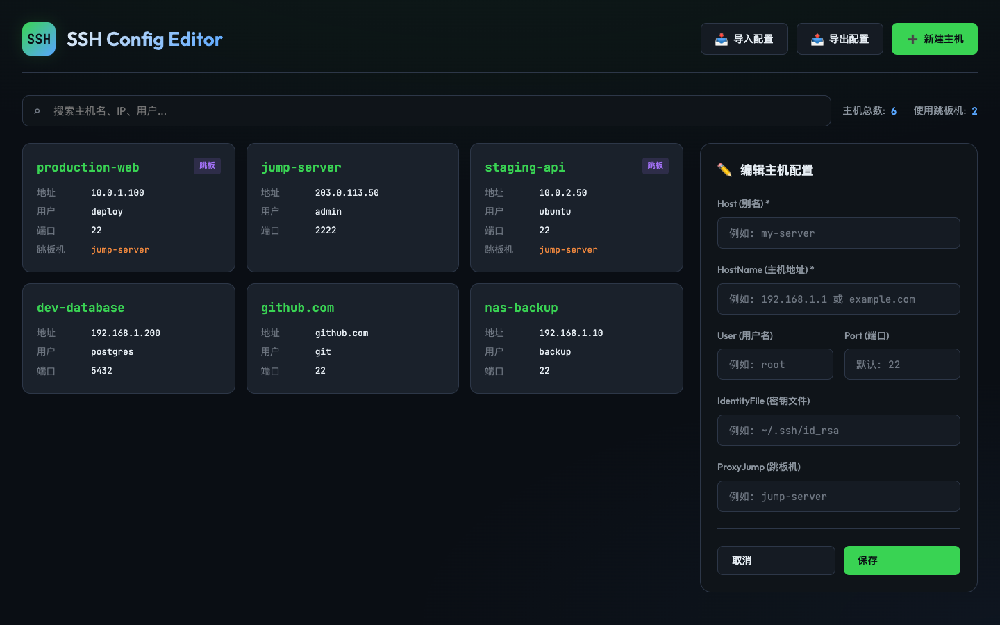

# SSH Config Editor

A sleek, browser-based visual editor for SSH config files. No installation, no dependencies — just open and use.

## Features

- **Import & Export** — Paste or drag-and-drop your `~/.ssh/config` file, edit visually, then export back
- **Visual Card Layout** — Each host displayed as a card with key details at a glance
- **Search** — Quickly filter hosts by name, IP, user, or proxy
- **Add / Edit / Delete** — Full CRUD operations on SSH host entries
- **Proxy Jump Support** — Visual indicator for hosts using jump servers
- **Copy & Download** — Export config to clipboard or download as a file
- **Dark Theme** — Easy on the eyes with a GitHub-inspired dark UI
- **Responsive** — Works on desktop and mobile

## Usage

**Online:** Visit [https://mereithhh.github.io/ssh-configer/](https://mereithhh.github.io/ssh-configer/)

**Local:** Just open `index.html` in your browser — it's a single self-contained HTML file with zero dependencies.

### Quick Start

1. Click **Import** and paste your SSH config (or drag-and-drop the file)
2. Edit hosts visually using the side panel
3. Click **Export** to copy or download the updated config

## Privacy

Everything runs entirely in your browser. No data is sent to any server.

## License

MIT
